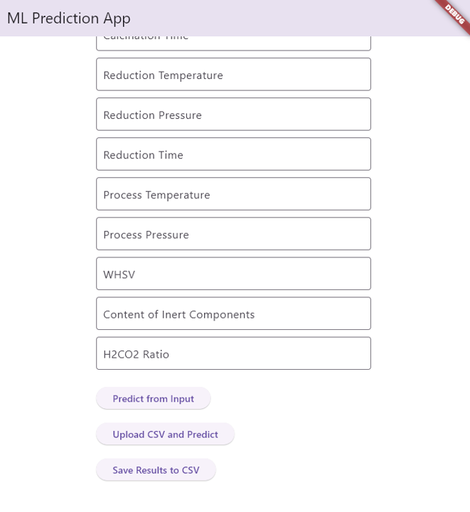

# CH4-CatalystML-Thermo

## Fine-Tuned Model

This repository contains a fine-tuned machine learning model for catalyst analysis and thermodynamic predictions related to CH₄ production.

## Recipe for Setup and Use

### Ingredients:
- **Python** (Flask for backend)
- **Flutter** (for front-end)
- **Machine Learning model** (fine-tuned)

### Backend Setup (Flask):
1. **Prepare the environment:**
   - Ensure Python is installed on your system.
   - Install required Python packages:
     ```bash
     pip install -r requirements.txt
     ```

2. **Navigate to the app directory:**
   ```bash
   cd app


